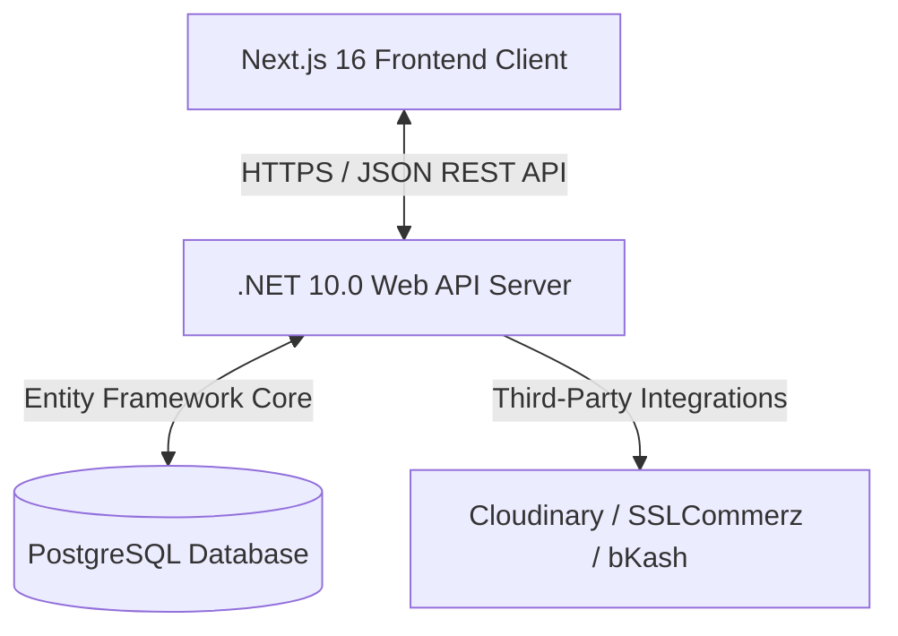

# 🏗️ VTCLBD

VTCLBD is a state-of-the-art construction, consultancy, and technical training platform engineered to empower design and civil engineering professionals across Bangladesh. It offers immersive video courses, interactive course progress tracking, automated certified credentials, and an advanced administrative panel to monitor student lifecycle, payments, and page copy (CMS) dynamically.

---

## 🚀 Key Features

*   **🎓 Interactive Student Dashboard**: Immersive video player, modular lesson checkoffs, resource links download, and dynamic course completion progress bars.
*   **📜 Automated Certificate Verification**: Immediate auto-issuance of unique, trackable PDF certificates upon 100% course progress checkoff.
*   **💳 BKash/SSLCommerz Payment Flow**: Real-time payment requests and an admin approval interface linked to course auto-enrollment.
*   **🛠️ Admin Control Suite**: Full role management (User ⇄ Admin), real-time user deletion, manual course enroll/unenroll, showcase project publishing, and inline live copies configuration (CMS).
*   **🎨 Premium frosted-glass design**: Clean responsive layouts built with modern CSS variables, glassmorphism UI, smooth hover animations, and high accessibility ratios.

---

## 🛠️ Architecture & Technology Stack



### Frontend Client
*   **Framework**: Next.js 16 (App Router)
*   **Styling**: Modern CSS variables & Tailwind CSS
*   **State & Querying**: `@tanstack/react-query` & `Axios`
*   **Form Management**: `react-hook-form` & `Zod`

### Backend Server
*   **Runtime**: .NET Core 10.0
*   **Database**: PostgreSQL
*   **ORM**: Entity Framework Core
*   **Authentication**: JWT Bearer Tokens & ASP.NET Core Identity

---

## 📦 Getting Started (Local Development)

### Prerequisites
*   Node.js (v22+) or Bun
*   .NET 10.0 SDK
*   PostgreSQL running locally (or via Docker)

### 1. Setting Up the Database & Backend
1.  Navigate to the `server/VTCLBD.API` folder.
2.  Set up your local Connection String inside `appsettings.json` (or `.env.local`):
    ```json
    "ConnectionStrings": {
      "DefaultConnection": "Host=localhost;Database=vtclbd_academy;Username=postgres;Password=yourpassword"
    }
    ```
3.  Apply entity migrations and seed initial demo data:
    ```bash
    dotnet ef database update
    ```
4.  Run the API server:
    ```bash
    dotnet run
    ```
    *The API will be available at `http://localhost:5237`.*

### 2. Setting Up the Frontend
1.  Navigate to the `client` directory.
2.  Create a `.env.local` file:
    ```env
    NEXT_PUBLIC_API_URL=http://localhost:5237/api
    ```
3.  Install dependencies:
    ```bash
    npm install
    # or
    bun install
    ```
4.  Launch the development server:
    ```bash
    npm run dev
    # or
    bun run dev
    ```
    *Open `http://localhost:3000` to interact with the platform.*

---

## 🐳 Docker Deployment & Orchestration

The application is fully containerized using multi-stage build files. To protect sensitive credentials, all connection parameters, database passwords, and secrets are read from a local `.env` file instead of being exposed inside the Compose file.

1.  Create a `.env` file in the root directory:
    ```env
    # Database Configurations
    DB_NAME=vtclbd_academy
    DB_USER=vtclbd_admin
    DB_PASSWORD=vtclbd_secure_password_2026

    # JWT Security Credentials
    JWT_KEY=VTCLBD_SuperSecretPremiumJWTKey_2026_SecureSecurityKey
    JWT_ISSUER=VTCLBD
    JWT_AUDIENCE=VTCLBD_Students

    # API Endpoint Configurations
    NEXT_PUBLIC_API_URL=http://localhost:5237/api
    ```

2.  Launch the entire stack seamlessly with a single command:
    ```bash
    docker compose up --build -d
    ```

### Docker Services Exposed
*   **Frontend client**: `http://localhost:3000`
*   **Backend server**: `http://localhost:5237`
*   **PostgreSQL DB**: `localhost:5432`

---

## 🛡️ Default Seeded Accounts

The database comes fully populated with rich demo courses, modules, videos, projects, and CMS blocks. Log in with the following default credentials to test:

| Role | Username / Email | Password |
| :--- | :--- | :--- |
| **Administrator** | `admin@vtclbd.com` | `Admin@123` |
| **Student** | `student@vtclbd.com` | `Student@123` |

---

## ⚙️ CI/CD Workflow Pipeline

A robust, production-grade GitHub Actions pipeline is active on push/PR to main branches. The steps validated automatically are:
1.  **Backend CI**: Restores dependencies, builds target files in release mode, and runs unit tests.
2.  **Frontend CI**: Installs modules, runs eslint checkups, and validates Next.js static builds.
3.  **Docker Dry Run**: Executes build steps for both backend and frontend Dockerfiles to ensure zero compilation drift.
