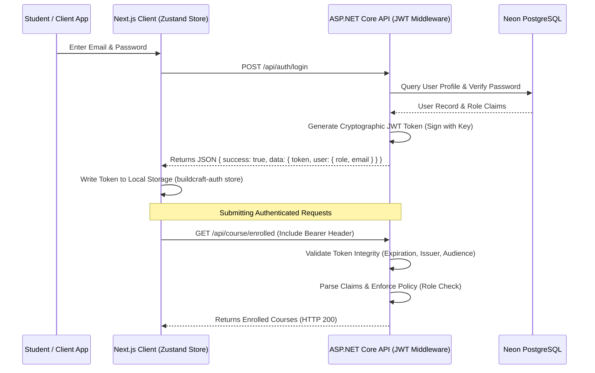

# 🔒 Authentication Flow
#auth #security

The VTCLBD ecosystem uses JWT-based authorization to secure communications between the Next.js client and the ASP.NET Core backend.

---

## 🛠️ Step-by-Step Security Walkthrough

---

## 🚪 Secure Session Expiration and Invalidation

1.  **JWT Verification**: The backend validates signature, issuer, audience, and lifetime parameters on every authorized request.
2.  **Request Authorization**: Requests without a header or with an expired token fail with an HTTP 401 Unauthorized status.
3.  **Automatic Logout**: The Next.js Axios client checks all responses. If an HTTP 401 status is encountered, it automatically runs the logout sequence:
    *   Clears the Zustand state `token` and `user` properties.
    *   Clears local storage keys.
    *   Redirects the browser immediately to `/auth/login`.

---

## 📁 Key Code Locations

*   **Server Config**: `Program.cs` under the `AddAuthentication` config.
*   **Client Store**: `client/stores/auth.store.ts` managing the Zustand auth slice.
*   **Axios Setup**: `client/lib/api.ts` managing request headers and response handlers.
