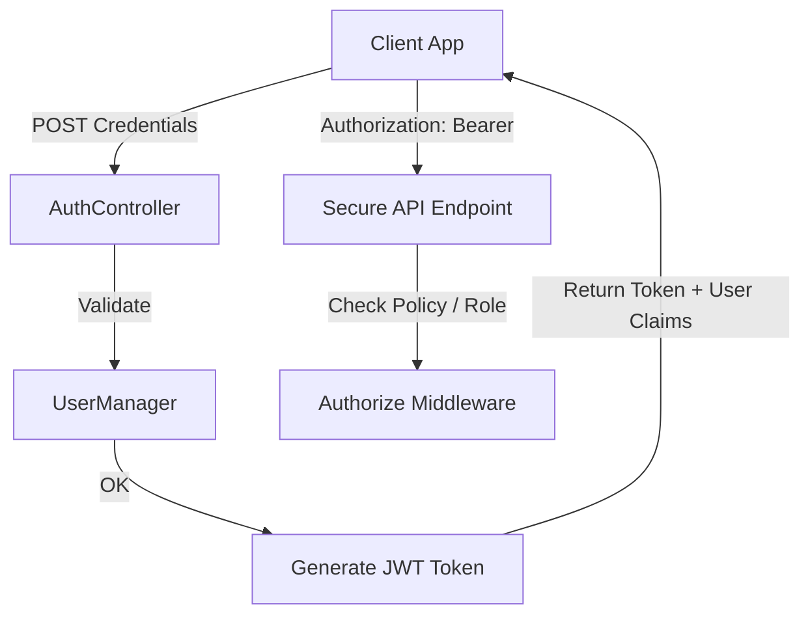

# ⚙️ Backend Architecture
#backend #architecture

The backend is built as an ASP.NET Core 10 Web API, structured following a clean service-controller pattern. It handles data processing, API endpoints, role-based authorization, and communication with the Neon serverless PostgreSQL database.

---

## 📂 Backend Structure Tree

```
server/
├── VTCLBD.API/
│   ├── Controllers/       # REST API endpoints (ControllerBase)
│   │   ├── AuthController.cs      # User login, registration, profile fetch
│   │   ├── CourseController.cs    # Trainings modules, and lessons endpoints
│   │   ├── PaymentController.cs   # Manual payment requests and approvals
│   │   └── ProjectController.cs   # Public CMS portfolio project CRUD operations
│   ├── Data/              # Entity Framework Context & Seed Scripts
│   │   ├── AppDbContext.cs        # Primary Database Context
│   │   └── DbSeeder.cs            # Seeds admin, student, courses, and CMS
│   ├── DTOs/              # Data Transfer Objects mapping requests and responses
│   │   ├── Auth/                  # Login, registration and profile DTOs
│   │   ├── Course/                # Course, module, and lesson detail DTOs
│   │   ├── Payment/               # Transaction request and approval DTOs
│   │   └── Project/               # Project listing and portfolio DTOs
│   ├── Interfaces/        # Service interfaces decouples logic from controllers
│   │   ├── ICourseService.cs
│   │   ├── IPaymentService.cs
│   │   ├── IProjectService.cs
│   │   └── IUserService.cs
│   ├── Models/            # Database entity models
│   │   ├── ApplicationUser.cs     # Custom IdentityUser class
│   │   ├── Course.cs              # Training metadata and specs
│   │   ├── Enrollment.cs          # Course-to-User active enrollments
│   │   ├── PaymentRecord.cs       # Transaction reference mapping
│   │   └── Project.cs             # Portfolio metadata
│   ├── Services/          # Concrete business logic implementations
│   │   ├── CourseService.cs
│   │   ├── PaymentService.cs
│   │   ├── ProjectService.cs
│   │   └── UserService.cs
│   ├── Common/            # Middleware and custom exception classes
│   ├── Program.cs         # Web application builder entry point
│   └── appsettings.json   # Production environment configurations
```

---

## 🌐 Dynamic Routing Configuration

The Web API builder in `Program.cs` implements lowercase URLs to ensure compatibility with client-side JavaScript routers:

```csharp
builder.Services.AddRouting(options => options.LowercaseUrls = true);
```

This enforces lowercase path conversion:
*   `GET /api/Payment` -> `GET /api/payment`
*   `DELETE /api/User/1` -> `DELETE /api/user/1`

---

## 🔒 Security Architecture (JWT + ASP.NET Identity)

The system uses JWT (JSON Web Tokens) to verify student and administrator requests:



*   **Authentication**: Configured in `Program.cs` via `JwtBearerDefaults.AuthenticationScheme`.
*   **Authorization Policy**: Secured using the `[Authorize(Roles = "Admin")]` or `[Authorize(Roles = "Student")]` attributes on controllers and specific endpoints.

---

## 🔗 Related Architecture Links

*   **API Specs**: [[api-structure]]
*   **Schema Map**: [[database-schema]]
*   **Access Protocols**: [[authentication-flow]]
