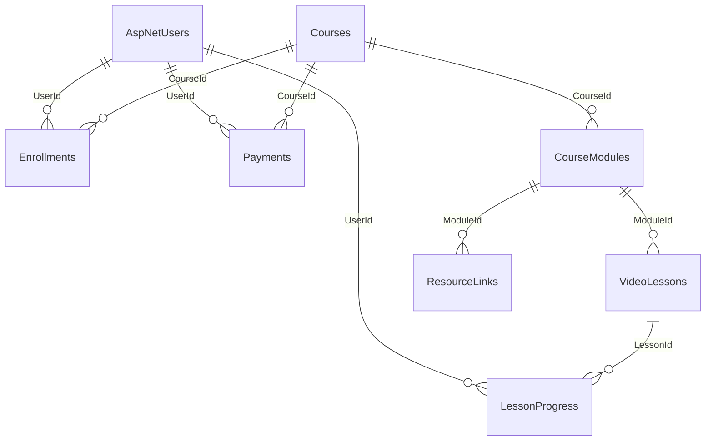

# 🗄️ Database Schema
#database #architecture

The database uses PostgreSQL (hosted on Neon serverless PostgreSQL). Entity Framework Core handles migrations, schema enforcement, and relational consistency.

---

## 🗺️ Entity Relationship Diagram

---

## 📋 Table Definitions

### 👤 AspNetUsers (ApplicationUser)
Inherits from IdentityUser with customized fields for user profile data:
*   `Id` (string, PK): Generated GUID.
*   `FullName` (string): The user's name.
*   `Role` (string): Standard role tracking (`Admin`, `Student`, `User`).
*   `IsActive` (bool): Soft deletion and block flag (defaults to `true`).
*   `CreatedAt` (DateTime): Registration date.

### 🎓 Courses
Stores course metadata and specifications:
*   `Id` (Guid, PK)
*   `Title` (string, Max 200)
*   `Description` (string)
*   `Price` (decimal)
*   `VideoUrl` (string): Demo/Promo video URL.
*   `InstructorName` (string)
*   `IsPublished` (bool)
*   `CreatedAt` / `UpdatedAt` (DateTime)

### 📂 CourseModules
Represents curriculum segments:
*   `Id` (Guid, PK)
*   `CourseId` (Guid, FK -> Courses)
*   `Title` (string)
*   `Description` (string)
*   `Order` (int): Grid display sorting value.
*   `IsPublished` (bool)

### 🎬 VideoLessons
Syllabus lessons containing educational video resources:
*   `Id` (Guid, PK)
*   `ModuleId` (Guid, FK -> CourseModules)
*   `Title` (string)
*   `VideoUrl` (string)
*   `DurationInSeconds` (int)
*   `Order` (int)
*   `IsPublished` (bool)

### 📁 ResourceLinks
Supplemental materials (e.g. PDFs, zip templates) attached to modules:
*   `Id` (Guid, PK)
*   `ModuleId` (Guid, FK -> CourseModules)
*   `Title` (string)
*   `Url` (string)
*   `Type` (string): PDF, ZIP, Link.

### ⛓️ Enrollments
Binds students to courses:
*   `Id` (Guid, PK)
*   `UserId` (string, FK -> AspNetUsers)
*   `CourseId` (Guid, FK -> Courses)
*   `EnrolledAt` (DateTime)
*   `IsActive` (bool): Track if enrollment remains active.

### 💳 Payments (PaymentRecord)
Tracks payment validation requests:
*   `Id` (Guid, PK)
*   `UserId` (string, FK -> AspNetUsers)
*   `CourseId` (Guid, FK -> Courses)
*   `Amount` (decimal)
*   `Status` (string): `Pending`, `Success`, `Rejected`.
*   `TransactionId` (string, Unique index): Reference code matching client transaction receipt.
*   `PaymentMethod` (string): `bKash`, `Nagad`, `Bank Transfer`.
*   `PhoneNumber` (string): Sender account number.

### 📈 LessonProgress
Tracks student completion across video lessons:
*   `Id` (Guid, PK)
*   `UserId` (string, FK -> AspNetUsers)
*   `LessonId` (Guid, FK -> VideoLessons)
*   `IsCompleted` (bool)
*   `CompletedAt` (DateTime)

---

## 🗑️ Cascading Delete Relational Integrity

To prevent database orphans when deleting a user, `UserService.cs` executes manual cascades:
1.  **Deletes** active `Enrollments` matching `UserId`.
2.  **Deletes** `PaymentRecord` history matching `UserId`.
3.  **Deletes** all `LessonProgress` data matching `UserId`.
4.  **Removes** the parent user record from the Identity store.

---

## 🔗 Related Schema Links

*   **API Specs**: [[api-structure]]
*   **System Setup**: [[backend-architecture]]
