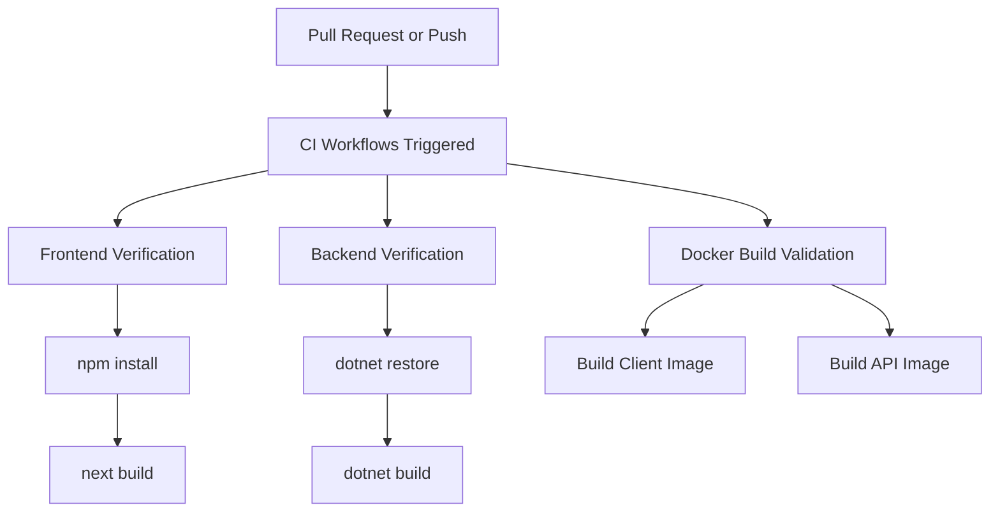

# 🚢 Deployment
#deployment #docker #ci-cd

The VTCLBD application is containerized using Docker and automated via GitHub Actions pipelines to ensure consistent environments from development to production.

---

## 🐋 Docker Containerization

The project uses Docker Compose to manage both frontend and backend microservices locally or in cloud VPS deployments.

### ⚙️ Docker Compose Structure (`docker-compose.yml`)

The root `docker-compose.yml` links the services and loads environments dynamically:

```yaml
version: '3.8'

services:
  db:
    image: postgres:15-alpine
    container_name: vtclbd_postgres
    environment:
      POSTGRES_DB: ${DB_NAME}
      POSTGRES_USER: ${DB_USER}
      POSTGRES_PASSWORD: ${DB_PASSWORD}
    ports:
      - "5432:5432"
    volumes:
      - postgres_data:/var/lib/postgresql/data

  api:
    build:
      context: ./server
      dockerfile: Dockerfile
    container_name: vtclbd_api
    depends_on:
      - db
    ports:
      - "5237:8080"
    environment:
      - ConnectionStrings__DefaultConnection=Host=db;Database=${DB_NAME};Username=${DB_USER};Password=${DB_PASSWORD}
      - Jwt__Key=${JWT_KEY}
      - Jwt__Issuer=${JWT_ISSUER}
      - Jwt__Audience=${JWT_AUDIENCE}

  client:
    build:
      context: ./client
      dockerfile: Dockerfile
      args:
        - NEXT_PUBLIC_API_URL=http://localhost:5237/api
    container_name: vtclbd_client
    ports:
      - "3000:3000"
    depends_on:
      - api
```

---

## 🚀 GitHub Actions Continuous Integration (CI)

The CI/CD pipeline validates every Pull Request and Push event targeting standard branches.



### 📋 CI Workflow Files

1.  **Backend CI** (`.github/workflows/backend-ci.yml`): Installs dependencies and verifies compilation of the .NET Web API project.
2.  **Frontend CI** (`.github/workflows/frontend-ci.yml`): Runs code style checks, TypeScript compiler validation, and the Next.js builder checks.
3.  **Docker Build Validation** (`.github/workflows/docker-ci.yml`): Validates container image compilation without deploying the resulting artifacts.
