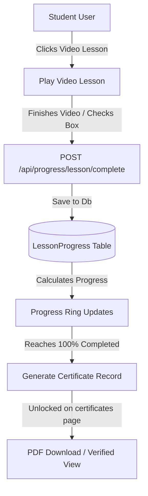

# 📊 Feature: Student Learning Dashboard & Certificates
#features #dashboard #certificates

This module powers the interactive student portal, which tracks module lesson progress, streams videos, manages course material downloads, and unlocks verification-ready certificates.

---

## 📈 Learning Progress Workflow

---

## 📜 Automated Certificate Issuance

Once a student completes 100% of the lessons in an enrolled course:
1.  **Generation**: The system automatically registers a certificate record inside the DB with a unique `certificateNumber` and issue date.
2.  **Display**: The student dashboard certificate screen reads this data via `/api/progress/certificate/{courseId}`.
3.  **Visual Output**: If the PDF is not yet stored on Cloudinary, the frontend renders a client-side certificate template featuring Victory Design & Construction Ltd styling.

---

## 💻 Code Implementations

*   **Enrolled Listing**: `/dashboard/courses` queries only active student enrollments via `courseService.getEnrolled()` [[database-schema]].
*   **Progress Math**: Percentage calculations compare completed lessons to total lessons in `ProgressService.cs`.
*   **Safety Check**: The dashboard queries are filtered by authenticated `UserId` on the backend, making it impossible to query other students' learning metrics.
