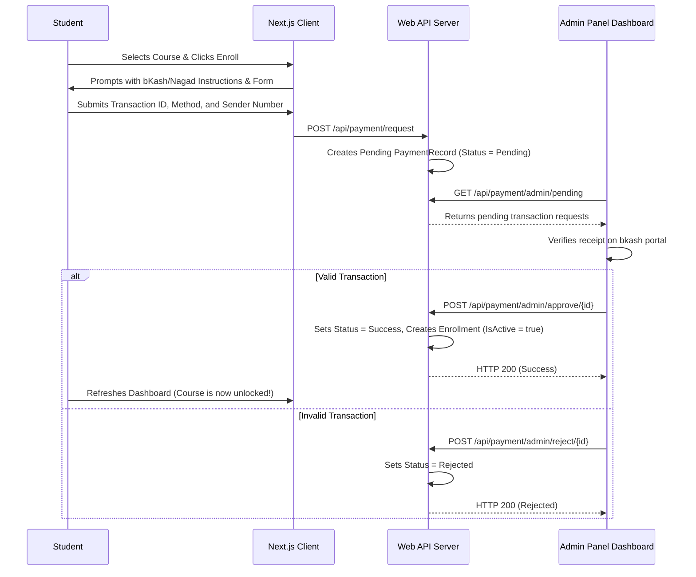

# 💳 Feature: Payment Verification & Enrollment Activation
#features #payments

This module manages the manual payment submission, transaction verification, and course enrollment activation workflow.

---

## 🔁 Enrollment Purchase Pipeline

---

## 💻 Code Implementations

*   **Payment Request Handler**: Handled inside `PaymentController.cs` under endpoint `/api/payment/request`.
*   **Database Record**: Defined as `PaymentRecord.cs` mapping transaction reference indexes.
*   **Safety Isolation**: Students can query only their own transactions, while admins have global access to review pending payments.
