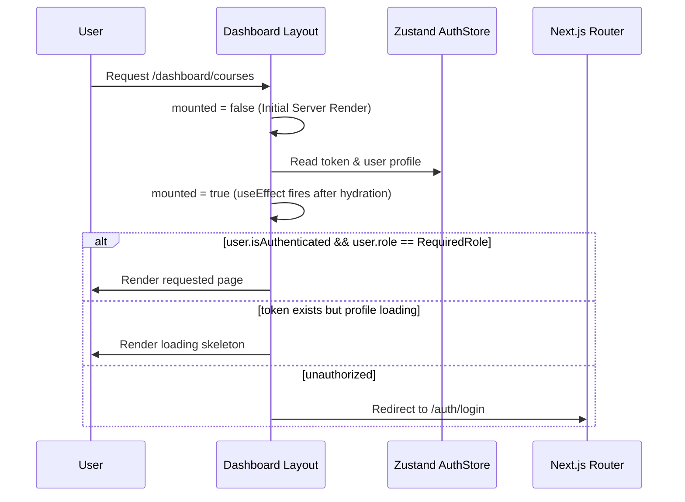

# 🎨 Frontend Architecture
#frontend #architecture

The Next.js 16 frontend is organized around the Next.js App Router conventions, React components, and React Query client state synchronization.

---

## 📂 Project Directory Structure

```
client/
├── app/                  # Routing entry points and layout files
│   ├── (admin)/          # Admin-only dashboard routes (layouts protected by Admin Guards)
│   ├── (dashboard)/      # Student dashboard routes (layouts protected by Student Guards)
│   ├── (public)/         # Public landing pages (Home, About, Careers, Projects, Courses)
│   ├── auth/             # Login and Registration routes
│   └── globals.css       # Core brand design system tokens and Global styles
├── components/           # Reusable UI component libraries
├── hooks/                # Custom React hooks (e.g. useMediaQuery)
├── lib/                  # Library utilities (Axios instance, global helper utils)
│   ├── api.ts            # Core Axios configuration with dynamic authorization injection
│   └── utils.ts          # Tailwind CSS merge and layout utility functions
├── services/             # API services communicating with backend controllers
│   ├── auth.service.ts   # Login, registration, profile fetch calls
│   ├── course.service.ts # Trainings, modules, and lessons CRUD operations
│   ├── progress.service.ts # Student progress tracking and certificates
│   └── job.service.ts    # Careers postings CRUD operations
├── stores/               # Zustand state stores
│   └── auth.store.ts     # User metadata, login status, and session token state
├── types/                # TypeScript interface mappings for backend models
└── package.json          # Dependency listings and execution scripts
```

---

## 🔒 Client-Side Route Guards (Hydration-Safe)

To prevent screen flashes and unauthorized redirection during hard refreshes, all dashboard layouts implement a double-pass hydration mount check.



See implementation details in [[authentication-flow]] and [[authentication]].

---

## 🌐 API Interaction and Interceptors

Axios is configured globally at `client/lib/api.ts`. It acts as the pipeline for client-server communication:
*   **Request Interceptor**: Extracts the JWT token from Zustand's persisted store (`buildcraft-auth`) and appends it to the `Authorization: Bearer <token>` header dynamically.
*   **Response Interceptor**: Intercepts 401 Unauthorized API responses. If a 401 occurs due to token expiration, it automatically triggers a logout by purging the Zustand store, terminating the session securely, and routing the user to the login screen.

---

## 🎨 Styling & Design Tokens

*   Uses Tailwind CSS utility classes.
*   Core brand colors (`#135c7c` and `#39c2e3`) are defined as OKLCH tokens inside `globals.css` [[colors]].
*   Fully responsive layout strategies are enforced using screen-width modifiers (`sm:`, `md:`, `lg:`, `xl:`) [[responsive-rules]].
