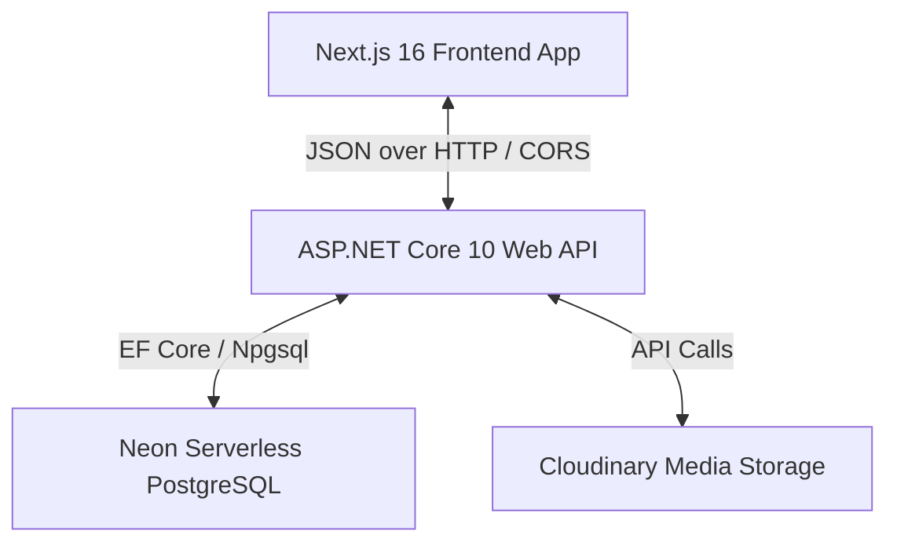

# 🌐 Project Overview
#architecture #overview #vtclbd

Victory Technologies and Construction Ltd (**VTCLBD**) is a premium, full-stack enterprise web platform designed to operate as a dual-purpose system:
1. **Professional Consultancy & Construction Showroom**: A high-end public interface showcasing the firm's architectural design portfolio, heavy construction projects, interior design expertise, and open career roles.
2. **Professional Training Academy**: A learning management system (LMS) where students can enroll in expert-led construction, interior design, and structural engineering training programs, watch video lessons, download resources, and earn verification-ready certificates.

---

## 🏛️ Core Architecture Layout

The platform uses a decoupled client-server architecture:

*   **Frontend Client**: Built with Next.js 16 (App Router, Turbopack) using React 19, Zustand for authentication state, GSAP for rich animations, and Tailwind CSS for utility styling.
*   **Backend Server**: A clean, scalable ASP.NET Core 10 Web API utilizing Entity Framework Core (EF Core) with PostgreSQL, ASP.NET Core Identity, JWT authentication, and structured DTO routing.
*   **Database layer**: Hosted on Neon serverless PostgreSQL, utilizing database migrations managed through EF Core.

---

## 🔗 Knowledge Graph Map

*   **Stack Details**: [[tech-stack]]
*   **Frontend Systems**: [[frontend-architecture]]
*   **Backend Codebase**: [[backend-architecture]]
*   **Database Layout**: [[database-schema]]
*   **API Directory**: [[api-structure]]
*   **Access Protocols**: [[authentication-flow]]
*   **Operations & Deploy**: [[deployment]]

---

## 📈 System Key Features

1. **User Authentication & Authorization**: Roles managed strictly across Admin, Student, and User [[authentication]]
2. **Student Dashboard & Progress**: Interactive learning portal tracking video completion percentage [[dashboard]]
3. **Admin payments Approval**: Transaction reference checking and manual enrollment verification [[payments]]
4. **Interactive Portfolio (CMS)**: Manage blocks and showcase projects with media upload support [[cms]]
5. **Careers Portal**: Public jobs showcase and administrative CRUD pipeline [[careers]]
