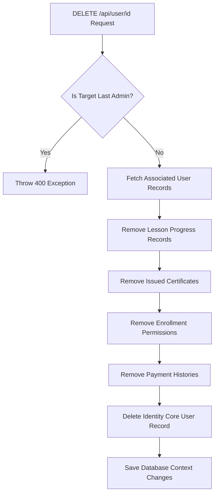

# 🏗️ VTCLBD Complete Technical & Architectural Documentation

VTCLBD is a premium, enterprise-grade web application offering an architectural/construction portfolio showcase combined with a robust e-learning academy for civil engineers, interior designers, and AutoCAD professionals. 

This document serves as the absolute source of truth for the system architecture, database design, API schemas, frontend structure, role permissions, cascading life cycles, containerized deployments, and continuous integration workflows.

---

## 📂 Codebase & Folder Directory Structure

### 1. Backend Server Directory: `server/`
The backend is structured according to **Clean Architecture** patterns, separating concerns between controllers, data layers, business interfaces, and service implementations:

```
server/
├── Dockerfile                   # Multi-stage production build script (.NET 8 SDK & Runtime)
├── VTCLBD.slnx                  # Solution configuration reference
└── VTCLBD.API/                  # Core Web API Application Project
    ├── Program.cs               # Application entry point, DI containers, and middlewares config
    ├── VTCLBD.API.csproj        # NuGet dependencies and compile configurations
    ├── appsettings.json         # Base configuration schemas (CORS, JWT duration, pagination)
    ├── appsettings.Development.json # Development overrides
    ├── Common/
    │   └── ApiResponse.cs       # Unified JSON response generic structure
    ├── Configs/
    │   └── AppDbContext.cs      # EF Core PostgreSQL database context, table schemas & configurations
    ├── Controllers/
    │   ├── AuthController.cs    # Registration, login, and profile fetching
    │   ├── CourseController.cs  # Course management, publish toggles, and enrolled filters
    │   ├── PaymentController.cs # Purchase transactions registration and admin approvals
    │   ├── ProgressController.cs# Lesson checkoffs and certificate retrievals
    │   ├── ProjectController.cs # Public architectural showcase management
    │   ├── UserController.cs    # User role management, manuals, and delete lifecycles
    │   └── CmsController.cs     # Live sitecopy configuration blocks
    ├── Data/
    │   └── DbSeeder.cs          # Database seeder class (injects initial Admin/Student & courses)
    ├── DTOs/
    │   ├── AuthDto.cs           # User credentials exchange contracts
    │   ├── CourseDto.cs         # Course payloads
    │   ├── PaymentDto.cs        # Transaction records payloads
    │   └── UserDto.cs           # Profiles and course assignment records
    ├── Helpers/
    │   └── ApiException.cs      # Global API custom error exceptions
    ├── Interfaces/
    │   ├── ICourseService.cs
    │   ├── IPaymentService.cs
    │   ├── IProgressService.cs
    │   ├── IProjectService.cs
    │   ├── IUserService.cs
    │   └── ICmsService.cs
    ├── Middlewares/
    │   └── ExceptionMiddleware.cs # Global Exception Filter transforming server crashes into JSON responses
    ├── Migrations/              # Entity Framework Core auto-generated SQL scripts
    └── Services/
        ├── CourseService.cs     # Course listings and modular video associations logic
        ├── PaymentService.cs    # Real-time transaction validation and automatic enrollments
        ├── ProgressService.cs   # Progress tracker and certificate verification logic
        ├── ProjectService.cs    # Public catalog showcase transactions
        ├── UserService.cs       # Role escalations and cascading account deletions
        └── CmsService.cs        # Dynamic key-value copy configurations
```

### 2. Frontend Client Directory: `client/`
The frontend client uses Next.js 14 App Router, built with dynamic queries, modular components, and rich CSS:

```
client/
├── Dockerfile                   # Multi-stage Next.js compile file
├── package.json                 # Dependency lock file (bun/npm)
├── tailwind.config.ts           # CSS branding theme setup
├── app/                         # App Router directory
│   ├── layout.tsx               # Root viewport setup and context providers
│   ├── page.tsx                 # Core home page (Hero, Services, Projects, Stats)
│   ├── (auth)/                  # Isolated Auth layouts and routes
│   │   ├── login/page.tsx       # Auth login page with pre-populated test user cards
│   │   └── register/page.tsx    # Registration page
│   ├── (dashboard)/             # Student Dashboard layouts and sub-routes
│   │   ├── dashboard/page.tsx   # Enrolled courses, completions summary
│   │   ├── dashboard/courses/[id]/page.tsx # Course player interface (integrated video and resource downloads)
│   │   └── dashboard/certificates/page.tsx # Issued credential verification listings
│   └── (admin)/                 # Administrative secure dashboard views
│       ├── admin/courses/page.tsx # Unified Course/Module management using overlays
│       ├── admin/cms/page.tsx   # Site copy config blocks (frosted glass modal overlays)
│       ├── admin/payments/page.tsx # BKash/SSLCommerz payments manual approval dashboard
│       ├── admin/projects/page.tsx # Project portfolio showcases configurations (modals)
│       └── admin/users/page.tsx # User lists, role assignments, manual unenrolls & deletions
├── components/                  # Global reusable visual elements
│   ├── Navbar.tsx               # Responsive modern header with active scroll states
│   └── Footer.tsx               # Site footers containing dynamic CMS phone/emails
├── lib/
│   └── api.ts                   # Axios configuration with 401 token-expiry interceptors
├── services/                    # API connection handlers
│   ├── course.service.ts
│   ├── cms.service.ts
│   ├── payment.service.ts
│   └── user.service.ts
└── stores/
    └── auth.store.ts            # Zustand persistent authentication store
```

---

## 🗄️ Database Architecture & Entity Relations

VTCLBD uses a highly relational PostgreSQL schema optimized for fast retrieval and ACID transactions. 

```
                          ┌───────────────────────┐
                          │    ApplicationUser    │
                          └──────────┬────────────┘
                                     │ 1
              ┌──────────────────────┼──────────────────────┐
            * │                      │ *                    │ *
     ┌────────┴─────────┐   ┌────────┴─────────┐   ┌────────┴─────────┐
     │    Enrollment    │   │  PaymentRecord   │   │   Certificate    │
     └────────┬─────────┘   └────────┬─────────┘   └────────┬─────────┘
            * │                      │ *                    │ *
              │                      │                      │
              └──────────────────────┼──────────────────────┘
                                     │ 1
                          ┌──────────┴────────────┐
                          │        Course         │
                          └──────────┬────────────┘
                                     │ 1
                                     │ *
                          ┌──────────┴────────────┐
                          │     CourseModule      │
                          └──────────┬────────────┘
                                     │ 1
                         ┌───────────┼───────────┐
                       * │                       │ *
              ┌──────────┴────────┐     ┌────────┴──────────┐
              │    VideoLesson    │     │   ResourceLink    │
              └───────────────────┘     └───────────────────┘
```

### Table Definitions & Column Specifications

1.  **`AspNetUsers` (ApplicationUser)**:
    *   Stores core user profiles, encrypted password hashes, status markers, and roles.
    *   *Columns*: `Id` (GUID string), `FullName`, `Email`, `Role` (`"Admin"` | `"Student"` | `"User"`), `IsActive` (bool), `CreatedAt` (DateTime), `ProfilePictureUrl`.
2.  **`Courses` (Course)**:
    *   Stores course blueprints.
    *   *Columns*: `Id` (GUID), `Title`, `Description`, `Price` (decimal BDT), `InstructorName`, `ImageUrl`, `IsPublished` (bool), `CreatedAt` (DateTime).
3.  **`CourseModules` (CourseModule)**:
    *   Divides courses into organized learning sections.
    *   *Columns*: `Id` (GUID), `CourseId` (Foreign Key -> `Courses.Id`), `Title`, `Order` (int), `CreatedAt`.
4.  **`VideoLessons` (VideoLesson)**:
    *   Hosts lessons containing video streams.
    *   *Columns*: `Id` (GUID), `ModuleId` (Foreign Key -> `CourseModules.Id`), `Title`, `VideoUrl` (string), `DurationInSeconds` (int), `Order` (int), `IsPublished` (bool).
5.  **`ResourceLinks` (ResourceLink)**:
    *   Stores supplemental learning material downloads (PDFs, templates, drawings).
    *   *Columns*: `Id` (GUID), `ModuleId` (Foreign Key -> `CourseModules.Id`), `Title`, `Url`, `Type` (`"PDF"` | `"Link"` | `"Zip"`), `CreatedAt`.
6.  **`Enrollments` (Enrollment)**:
    *   Maps access permissions between users and courses.
    *   *Columns*: `Id` (GUID), `UserId` (Foreign Key -> `AspNetUsers.Id`), `CourseId` (Foreign Key -> `Courses.Id`), `EnrolledAt` (DateTime), `IsActive` (bool).
7.  **`PaymentRecords` (PaymentRecord)**:
    *   Tracks financial payment transactions.
    *   *Columns*: `Id` (GUID), `UserId` (Foreign Key -> `AspNetUsers.Id`), `CourseId` (Foreign Key -> `Courses.Id`), `Amount` (decimal), `Status` (`"Pending"` | `"Success"` | `"Rejected"`), `TransactionId` (string, unique), `PaymentMethod` (`"bKash"` | `"Nagad"` | `"Bank"`), `PhoneNumber` (string), `CreatedAt`.
8.  **`Certificates` (Certificate)**:
    *   Issued credentials upon course completions.
    *   *Columns*: `Id` (GUID), `UserId` (Foreign Key -> `AspNetUsers.Id`), `CourseId` (Foreign Key -> `Courses.Id`), `CertificateNumber` (string, unique), `IssuedAt` (DateTime), `CertificateUrl` (string, nullable).
9.  **`ContentBlocks` (ContentBlock)**:
    *   Dynamic CMS text fields config, powering UI copy.
    *   *Columns*: `Id` (GUID), `Identifier` (string, unique index), `Content` (string), `Type` (`"Text"` | `"Html"` | `"ImageUrl"` | `"Json"`), `IsActive` (bool).
10. **`Projects` (Project)**:
    *   Showcase architectural and construction portfolio cards.
    *   *Columns*: `Id` (GUID), `Title`, `Description`, `Category` (`"Design"` | `"Construction"`), `ClientName`, `Location`, `CompletionDate` (DateTime, nullable), `Status` (`"Ongoing"` | `"Completed"` | `"Upcoming"`), `ImageUrl`, `VideoUrl`, `ClientReview`, `ClientReviewerName`, `SecondaryImages` (comma-separated string), `IsPublished` (bool).

---

## 🔒 Authentication & Authorization Security

VTCLBD implements tight authentication shields using JSON Web Tokens (JWT) containing structural cryptographically signed claims.

### The Authentication Flow
1.  **Register**: The client posts email, password, and full name to `/api/auth/register`. The server registers the account, assigning the default role of `"User"`.
2.  **Login**: User posts email and password to `/api/auth/login`. The server performs identity checkups, signs a security token, and returns a JSON payload:
    ```json
    {
      "token": "eyJhbGciOiJIUzI1NiIsInR5cCI6IkpXVCJ9...",
      "expiration": "2026-05-22T03:54:39Z",
      "user": {
        "id": "30925174-17d9-4adb-a055-ea65d6db91b0",
        "email": "student@vtclbd.com",
        "fullName": "Demo Student",
        "role": "Student"
      }
    }
    ```
3.  **Authorization**: The token is stored inside the local Zustand state and persistent storage. Subsequent requests append this string inside the headers:
    `Authorization: Bearer <TOKEN>`

### Axios Token Interceptor (`client/lib/api.ts`)
A custom Axios response interceptor acts as the application's gatekeeper, ensuring smooth session invalidations *only* when authentication tokens are genuinely expired:

```typescript
api.interceptors.response.use(
  (response) => response,
  (error) => {
    // Check if the server responds with a 401 Unauthorized status
    if (error.response && error.response.status === 401) {
      // Validate that the request actually contained an authentication header 
      // (avoiding false logouts on general network errors or public routing mismatches)
      const token = localStorage.getItem("auth-token");
      if (token) {
        localStorage.removeItem("auth-token");
        window.location.href = "/auth/login?expired=true";
      }
    }
    return Promise.reject(error);
  }
);
```

---

## ⚙️ Administration & CRUD Engine Modals

Admins control all application configurations directly inside the web browser. The CRUD processes are built using a unified UI structure.

### 1. Unified Frosted Glass Modal System
All add/edit configurations in the admin panel are enclosed inside a backdrop modal. This resolves the pain of scrolling up or down on long tables to locate configuration forms.

```
┌────────────────────────────────────────────────────────┐
│ [Background Content Locks - Scroll Disabled]           │
│                                                        │
│   ┌────────────────────────────────────────────────┐   │
│   │  Frosted Glass Backdrop (bg-black/60 backdrop) │   │
│   │                                                │   │
│   │   ┌────────────────────────────────────────┐   │   │
│   │   │           Modal Form Panel             │   │   │
│   │   │  (shadow-2xl bg-background rounded-2xl)│   │   │
│   │   │                                        │   │   │
│   │   │  * Grid form input layouts             │   │   │
│   │   │  * Integrated React Hook Form validation│   │   │
│   │   │  * In-place cancellation buttons       │   │   │
│   │   └────────────────────────────────────────┘   │   │
│   └────────────────────────────────────────────────┘   │
└────────────────────────────────────────────────────────┘
```

#### Modal Tailwind Markup Template:
```tsx
{(showForm || editingEntity) && (
  <div className="fixed inset-0 z-50 flex items-center justify-center bg-black/60 backdrop-blur-sm p-4 overflow-y-auto">
    <form
      onSubmit={handleSubmit(onSubmit)}
      className="rounded-2xl border border-border bg-background p-6 space-y-4 shadow-2xl w-full max-w-2xl my-8 relative animate-in fade-in zoom-in-95 duration-200"
    >
      {/* Scrollable, highly accessible modal layout */}
    </form>
  </div>
)}
```

---

### 2. User Accounts Deletion Cascading Lifecycle
Deleting a user record presents severe challenges in relational databases due to foreign key constraints in table associations (Enrollments, Payments, Progress, Certificates). VTCLBD implements a clean physical cascading deletion flow:



#### Code Implementation in `UserService.cs`:
```csharp
public async Task<bool> DeleteUserAsync(string userId)
{
    var user = await _userManager.FindByIdAsync(userId);
    if (user == null)
        throw new ApiException("Target user record not found.", 404);

    // Safety Guard: Stop deletion of the final system administrator
    if (user.Role == "Admin")
    {
        var admins = await _userManager.GetUsersInRoleAsync("Admin");
        if (admins.Count <= 1)
        {
            throw new ApiException("Security Constraint: The database must retain at least one administrator account.", 400);
        }
    }

    // 1. Clean progress trackers
    var progress = _context.LessonProgresses.Where(lp => lp.UserId == userId);
    _context.LessonProgresses.RemoveRange(progress);

    // 2. Clean certificates
    var certificates = _context.Certificates.Where(c => c.UserId == userId);
    _context.Certificates.RemoveRange(certificates);

    // 3. Clean active enrollments
    var enrollments = _context.Enrollments.Where(e => e.UserId == userId);
    _context.Enrollments.RemoveRange(enrollments);

    // 4. Clean payment histories
    var payments = _context.Payments.Where(p => p.UserId == userId);
    _context.Payments.RemoveRange(payments);

    // 5. Commit entity cleanups
    await _context.SaveChangesAsync();

    // 6. Delete user account
    var result = await _userManager.DeleteAsync(user);
    if (!result.Succeeded)
    {
        var errors = result.Errors.Select(e => e.Description);
        throw new ApiException("Failed to remove user credentials.", 500, errors);
    }

    return true;
}
```

---

### 3. Payment Approval Workflow
When a student requests a course using Bkash or Nagad, the payment status defaults to `"Pending"`. 

The admin page `/admin/payments` displays pending logs. Approving a payment executes an atomic process:
1.  **State Shift**: The status updates from `"Pending"` to `"Success"`.
2.  **Course Enrollment**: A record is appended to the `Enrollments` mapping user ID to course ID.
3.  **Role Elevation**: If the user's role is `"User"`, it is escalated to `"Student"`, granting immediate access to course dashboards.

---

## 📈 Learning Progress & Automatic Certificate Generation

VTCLBD implements an automated mechanism that monitors student study milestones and issues verified certificates in real-time.

### Progress Ratio Calculations
1.  A student watches a lesson and toggles the checkmark.
2.  The action fires a post request to `/api/progress/toggle`, inserting or deleting a row in the `LessonProgresses` table.
3.  The server fetches the total number of published lessons in the course ($L_{Total}$) and the number of completed lessons by the student ($L_{Done}$).
4.  The progress percentage is calculated as:
    $$\text{Progress} = \left( \frac{L_{Done}}{L_{Total}} \right) \times 100$$
5.  If $\text{Progress} = 100\%$, the server automatically triggers the internal method `TryIssueCertificateAsync(userId, courseId)`.

### Certificate Issuance & Fallback URL
*   When a certificate is issued, a unique alphanumeric identifier is generated:
    `CERT-yyyy-XXXXXXXX` (where `XXXXXXXX` represents a unique GUID snippet).
*   **Aesthetics Fallback**: In development or cloud environments where PDF generators are unconfigured, calling the public endpoint `/api/progress/certificate/{courseId}` intercepts empty certificate URL responses and falls back to a high-resolution credentials mockup template:
    `https://res.cloudinary.com/dniosv5ot/image/upload/v1779370284/certificate_mockup.png`
*   This prevents empty screens and ensures the student is presented with a professional certificate preview immediately.

---

## 🐳 Docker Production Orchestration

The application utilizes optimized Dockerfiles for both frontend and backend services, orchestrated securely through environment variables to hide sensitive keys.

### 1. Root `.env` Configurations Configuration
To protect sensitive parameters from git history, all secrets are kept inside a root `.env` file:
```env
# Database Configurations
DB_NAME=vtclbd_academy
DB_USER=vtclbd_admin
DB_PASSWORD=vtclbd_secure_password_2026

# JWT Security Credentials
JWT_KEY=VTCLBD_SuperSecretPremiumJWTKey_2026_SecureSecurityKey
JWT_ISSUER=VTCLBD
JWT_AUDIENCE=VTCLBD_Students

# API Public Endpoints
NEXT_PUBLIC_API_URL=http://localhost:5237/api
```

---

### 2. Multi-Stage Dockerfile Setups

#### Backend: `server/Dockerfile`
```dockerfile
# Stage 1: NuGet Restore & Build
FROM mcr.microsoft.com/dotnet/sdk:8.0 AS build
WORKDIR /src

COPY ["VTCLBD.API/VTCLBD.API.csproj", "VTCLBD.API/"]
RUN dotnet restore "VTCLBD.API/VTCLBD.API.csproj"

COPY . .
WORKDIR "/src/VTCLBD.API"
RUN dotnet build "VTCLBD.API.csproj" -c Release -o /app/build

# Stage 2: Publish output files
FROM build AS publish
RUN dotnet publish "VTCLBD.API.csproj" -c Release -o /app/publish /p:UseAppHost=false

# Stage 3: Lightweight ASP.NET Core Runtime 
FROM mcr.microsoft.com/dotnet/aspnet:8.0 AS final
WORKDIR /app
COPY --from=publish /app/publish .

ENV ASPNETCORE_URLS=http://+:5237
ENV ASPNETCORE_ENVIRONMENT=Production
EXPOSE 5237

ENTRYPOINT ["dotnet", "VTCLBD.API.dll"]
```

#### Frontend Next.js: `client/Dockerfile`
```dockerfile
# Stage 1: Build static Next.js assets
FROM node:20-alpine AS builder
WORKDIR /app

COPY package*.json ./
RUN npm ci

COPY . .

# Set dynamic API URL argument
ARG NEXT_PUBLIC_API_URL=http://localhost:5237/api
ENV NEXT_PUBLIC_API_URL=$NEXT_PUBLIC_API_URL

RUN npm run build

# Stage 2: Runtime Runner
FROM node:20-alpine AS runner
WORKDIR /app

ENV NODE_ENV=production
ENV PORT=3000

COPY --from=builder /app/package*.json ./
COPY --from=builder /app/.next ./.next
COPY --from=builder /app/public ./public
COPY --from=builder /app/node_modules ./node_modules

EXPOSE 3000
CMD ["npm", "start"]
```

---

### 3. Database & App Orchestration (`docker-compose.yml`)
The orchestration pulls the configuration variables directly from the `.env` file at runtime, avoiding hardcoded values:

```yaml
version: '3.8'

services:
  # PostgreSQL Engine
  db:
    image: postgres:15-alpine
    container_name: vtclbd-db
    restart: always
    environment:
      POSTGRES_DB: ${DB_NAME}
      POSTGRES_USER: ${DB_USER}
      POSTGRES_PASSWORD: ${DB_PASSWORD}
    ports:
      - "5432:5432"
    volumes:
      - pgdata:/var/lib/postgresql/data
    healthcheck:
      test: ["CMD-SHELL", "pg_isready -U ${DB_USER} -d ${DB_NAME}"]
      interval: 10s
      timeout: 5s
      retries: 5

  # .NET 8 Web API
  backend:
    build:
      context: ./server
      dockerfile: Dockerfile
    container_name: vtclbd-backend
    restart: always
    ports:
      - "5237:5237"
    environment:
      - ConnectionStrings__DefaultConnection=Host=db;Database=${DB_NAME};Username=${DB_USER};Password=${DB_PASSWORD}
      - Jwt__Key=${JWT_KEY}
      - Jwt__Issuer=${JWT_ISSUER}
      - Jwt__Audience=${JWT_AUDIENCE}
      - Jwt__DurationInMinutes=60
      - ASPNETCORE_ENVIRONMENT=Production
      - ASPNETCORE_URLS=http://+:5237
    depends_on:
      db:
        condition: service_healthy

  # Next.js Frontend
  frontend:
    build:
      context: ./client
      dockerfile: Dockerfile
      args:
        - NEXT_PUBLIC_API_URL=${NEXT_PUBLIC_API_URL}
    container_name: vtclbd-frontend
    restart: always
    ports:
      - "3000:3000"
    environment:
      - PORT=3000
      - NODE_ENV=production
      - NEXT_PUBLIC_API_URL=${NEXT_PUBLIC_API_URL}
    depends_on:
      - backend

volumes:
  pgdata:
```

---

## ⚙️ Continuous Integration (CI/CD)

The GitHub Actions workflow (.github/workflows/ci-cd.yml) runs on every push or pull request to the `main`, `master`, or `final-branch` branches.

It executes the following tasks to ensure application stability:
1.  **Backend Verification**: Sets up .NET Core 8.0 SDK, restores solution dependencies (`VTCLBD.slnx`), builds binary configurations, and executes backend unit tests.
2.  **Frontend Compilation Validation**: Sets up Node.js 20 environment, installs project dependencies from package-lock cache, runs syntax linter, and triggers Next.js production builds.
3.  **Docker Dry Run builds**: Triggers builds of both backend and frontend Dockerfiles in test-mode to guarantee zero runtime image mismatches before deployments.

---

## 💡 Troubleshooting & Essential Code Patches

### 1. JSON Generics Serialization Bug
*   **Symtoms**: Dynamic generic API classes (like `ApiResponse<bool>`) throwing runtime exceptions on serialization.
*   **Resolution**: Switched from `WhenWritingNull` to `WhenWritingDefault` inside `ApiResponse.cs` configurations. This preserves clean empty structures for complex payload serialization without server crashes.

### 2. GSAP "Target Not Found" Warnings
*   **Symptoms**: Next.js App Router throwing console selectors warnings during transitions.
*   **Resolution**: Split complex landing page animations so that GSAP triggers strictly *after* UI queries return verified non-empty state lists, ensuring targets exist in the DOM when triggered.
